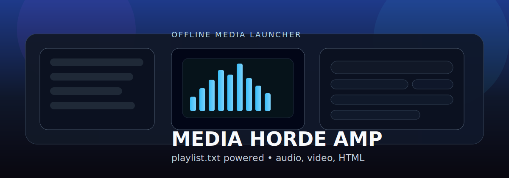

# Media Horde AMP

A GitHub-friendly offline media launcher for giant local libraries. The app reads a `playlist.txt` file that lives in the same folder as `index.html`, which is a hell of a lot saner than welding your entire media database into one HTML file and calling it architecture.



## What it does

Media Horde AMP is meant for messy personal media archives, USB drives, school-safe offline launchers, and static hosting setups where you want one page that can:

- load audio, video, and HTML/web entries from `playlist.txt`
- search, sort, and filter by type, folder, favorites, and recents
- preview audio album art and play audio/video directly in the page
- open HTML items in a new tab
- keep favorites, recents, and volume in browser storage
- work on GitHub Pages
- fall back to manual `playlist.txt` loading if `file://` blocks `fetch()`

## Repo layout

```text
media-horde-amp/
├─ index.html
├─ playlist.txt
├─ README.md
├─ LICENSE
├─ CONTRIBUTING.md
├─ CHANGELOG.md
├─ .gitignore
├─ assets/
│  ├─ css/
│  │  └─ styles.css
│  ├─ img/
│  │  └─ media-horde-amp-banner.svg
│  └─ js/
│     ├─ config.js
│     ├─ utils.js
│     ├─ playlist.js
│     ├─ player.js
│     ├─ ui.js
│     └─ app.js
└─ tools/
   ├─ build_playlist.py
   ├─ build_playlist.bat
   └─ build_playlist.ps1
```

## Important rule

Put `playlist.txt` in the **same folder** as `index.html`.

That means the root should look like this:

```text
your-library/
├─ index.html
├─ playlist.txt
├─ music/
├─ videos/
├─ games/
├─ covers/
└─ assets/
```

Your media folders can be whatever you want. Just keep the paths in `playlist.txt` relative to that root.

## Quick start

### Option 1: use it locally
1. Put this repo in your media root or next to your media folders.
2. Run one of the playlist builders:
   - `python tools/build_playlist.py`
   - `tools\build_playlist.bat`
   - `powershell -ExecutionPolicy Bypass -File tools\build_playlist.ps1`
3. Open `index.html`
4. If your browser blocks `playlist.txt` on `file://`, click **Load playlist.txt** and choose the file manually

### Option 2: use a tiny local server
From the repo root:

```bash
python -m http.server 8000
```

Then open:

```text
http://localhost:8000/
```

### Option 3: host it on GitHub Pages
1. Create a repo
2. Upload this structure
3. Commit your media and `playlist.txt`
4. Enable GitHub Pages
5. Keep `playlist.txt` next to `index.html`

## Playlist format

Each non-empty line is:

```text
relative/path/to/file.ext | key=value | key=value
```

### Example

```text
# comments are allowed
music/song.mp3
videos/demo.mp4 | title=Cool Demo | size=42 MB
games/mygame/index.html | title=My Game | type=html
music/song.mp3 | art=covers/song.jpg | title=Song With Art
```

### Supported metadata keys

- `title=Custom Title`
- `type=audio|video|html`
- `folder=Custom Folder Name`
- `size=12 MB`
- `art=relative/path/to/cover.jpg`
- `cover=relative/path/to/cover.jpg`

You usually do **not** need to set `type`. The app infers it from the file extension.

## Included tools

### `tools/build_playlist.py`
Scans the current folder recursively and writes `playlist.txt`.

```bash
python tools/build_playlist.py
```

Useful options:

```bash
python tools/build_playlist.py --root . --output playlist.txt
python tools/build_playlist.py --exclude covers --exclude temp
python tools/build_playlist.py --no-size
```

By default the builder writes human-readable `size=` metadata so the launcher can show visible library size without doing extra browser nonsense.

### `tools/build_playlist.bat`
Windows double-click wrapper for the Python script.

### `tools/build_playlist.ps1`
PowerShell wrapper for people who enjoy pain with more colors.

## Features in the launcher

- **Search** by title, filename, folder, extension, favorite, or recent status
- **Filters** for all, audio, video, web, favorites, and recents
- **Sort modes** for playlist order, name, folder, type, and recently opened
- **Playback** for audio and video with transport controls
- **Visualizer** for audio playback
- **Album art** support with `art=` or `cover=`
- **Download selected** button and `Ctrl + D`
- **Keyboard shortcuts**
  - `Enter` open selected
  - `Space` play/pause
  - `Up / Down` move selection
  - `Ctrl + D` download selected

## Notes

- HTML items open in a new tab.
- Favorites, recent items, and volume are stored in browser local storage.
- If size totals show as unknown, rebuild the playlist with the included script so it writes `size=` metadata.
- If filenames contain spaces or weird symbols, keep the paths exactly as they are relative to the repo root. The app URL-encodes them automatically because browsers love turning simple things into tiny bureaucracies.

## Good commit ideas

```text
Initial Media Horde AMP repo architecture with playlist.txt support
Add recent items, download action, and playlist builder wrappers
Document local and GitHub Pages setup
```

## Future ideas

- grid/card view for HTML games
- playlist export for favorites
- theme switcher
- drag-and-drop playlist import
- optional thumbnail cache for videos

Because every launcher eventually becomes a desktop environment if you neglect it long enough.
